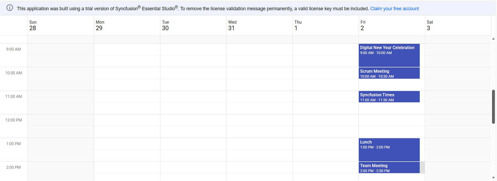
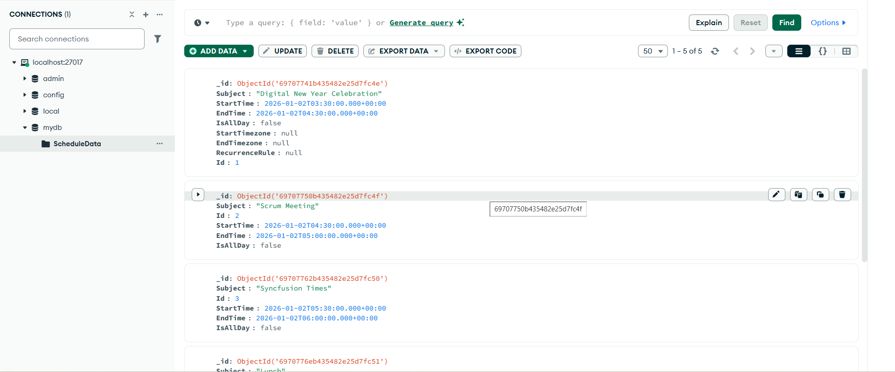

# Getting Started with Angular Scheduler Component using MEAN Stack (MongoDB, Express, Angular, Node)

## Description

This repository showcases a full‑stack sample application that demonstrates how to integrate the Syncfusion Angular Scheduler component into a Angular application with a Node.js and MongoDB backend.<br />
The backend provides REST API endpoints for managing calendar events, which are stored in MongoDB. The React frontend delivers a responsive scheduling interface, enabling users to create, update, view, and delete events seamlessly using Syncfusion’s Scheduler component.

<br />

## Prerequisites
- Use Node Version >= 20.19.0 (for better performance with MongoDB driver 7.0)
- Use Latest MongoDB Software.
- Make sure there is nothing running on the ports 5000, 4200.

<br />

## Project Structure
```
├── src
│     ├── app
│     │    ├── app.component.css
│     │    ├── app.component.html
│     │    ├── app.component.spec.ts
│     │    ├── app.component.ts
│     │    └── app.module.ts
│     ├── environments
│     │    ├── environment.prod.ts
│     │    └── environment.ts
│     ├── server
│     │    └── server.js
│     ├── main.ts              
│     ├── pollfills.ts
│     ├── style.css
│     ├── system.js.config.js             
│     ├── test.ts
│     ├── tsconfig.app.json
│     ├── tsconfig.spec.json              
│     └── typings.d.ts
├── .angular-cli.json
├── .editorconfig              
├── angular.json
├── karma.config.js
├── package.lock.json
├── package.json              
├── protractor.config.js
├── README.md
├── tsconfig.json
└── tslint.json    
```
<br />

## Backend Setup

#### <u> MongoDB </u>

1. Create a Database named `mydb` in the default connection `localhost:27017` in MongoDB Compass.
2. Create a Collection named `ScheduleData` in the above created database.
3. Make sure this connection is in connected state in MongoDB Compass.

#### <u> Available Endpoints </u>
The Express server (`server.js`) exposes the following REST routes:
| Method | URL                          | Description                         |
| ------ | ---------------------------- | ----------------------------------- |
| POST   | `/GetData`                   | Fetch all the events                |
| POST   | `/BatchData`                 | Insert/Update/Delete event          |

<br />

## Frontend Setup

#### <u> Installation </u>
1. In a new terminal, navigate to the project folder:
2. Install application dependencies:
    ```bash
    npm install
    ```
<br />

## Running the Application
1. Navigate to the project folder.
2. Start the backend server:
    ```bash
    npm run server (runs the server.js file)
    ```
3. Backend server started running on `http://localhost:5000`
4. Start the frontend:
    ```bash
    npm start
    ```
5. Navigate to [http://localhost:4200](http://localhost:4200) in your browser.<br />
    The page will reload if you make edits.<br />
    You will also see any lint errors in the console.

<br />

# Sample Outputs

*Image illustrating the Syncfusion Angular Scheduler* 


*Image illustrating the events of the Syncfusion Angular Scheduler in the MongoDB* 

<br />

## Troubleshooting
- **404 PageNotFound**: Ensure the backend server running on `localhost:5000`.
- **CORS errors**: Ensure the frontend running on `localhost:4200`.

<br />
<br />
<br />
<br />

# Creating a MEAN (MongoDB, Express, Angular, Node) Application Using Syncfusion® Angular Scheduler Component

## Prerequisites
- Use Node Version >= 20.19.0 (for better performance with MongoDB driver 7.0)
- Use Latest MongoDB Software.
- Make sure there is nothing running on the ports 5000, 4200.

<br />

## Database Setup

#### <u> MongoDB </u>

1. Download the mongoDB software from the below given link.
    - https://www.mongodb.com/try/download/community
2. Open MongoDB Compass, Create a Database in the connection
3. Create a Collection inside the above created database.
4. Make sure this connection is in connected state in MongoDB Compass.

<br />

## Application Setup

#### <u> Angular </u>

1. **You can use Angular CLI to set up your Angular applications.<br />** To install the Angular CLI, use the following command.
    ```bash
    npm install -g @angular/cli
    ```
2. **Create an Angular application**<br />
Create a new Angular application using the following Angular CLI command.
    ```bash
    ng new my-app
    cd my-app
    ```
    - Choose CSS stylesheet
    - Choose No for SSR as we will create server using express later.
3. **Installing Syncfusion® Schedule package**<br />
Syncfusion® packages are distributed on npm as @syncfusion scoped packages. You can find all the Angular Syncfusion® packages on [npm](https://www.npmjs.com/search?q=%40syncfusion%2Fej2-angular-).

    Syncfusion® provides two types of package structures for Angular components:

    1. Ivy library distribution package format
    2. Angular compatibility compiler(Angular’s legacy compilation and rendering pipeline) package.<br />
    <br />
        **Ivy library distribution package** <br />
        Syncfusion® Angular packages (>=20.2.36) use the Ivy distribution to support the Angular Ivy rendering engine and the package are compatible with Angular version 12 and above. Use the following command to install the latest Ivy package.

        Add [@syncfusion/ej2-angular-schedule](https://www.npmjs.com/package/@syncfusion/ej2-angular-schedule/v/20.2.38) package to the application. (`if you are using angular >= angular 12`)

        ```bash
        npm install @syncfusion/ej2-angular-schedule --save
        ```
        **Angular compatibility compiled (NGCC) package**<br />
        For Angular versions below 12, you can use the legacy (ngcc) package of the Syncfusion® Angular components. To download the ngcc package use the below.

        Add [@syncfusion/ej2-angular-schedule@ngcc](https://www.npmjs.com/package/@syncfusion/ej2-angular-schedule/v/20.2.38-ngcc) package to the application. (`if you are using angular < angular 12`)

        ```bash
        npm install @syncfusion/ej2-angular-schedule@ngcc --save
        ```
        To specify the NGCC package in `package.json`, add the `-ngcc` suffix to the version number.

        ```bash
        @syncfusion/ej2-angular-schedule:"20.2.38-ngcc"
        ```
        `Note: If the ngcc tag is not specified while installing the package, the Ivy Library Package will be installed and this package will throw a warning.`
4. **Adding CSS reference**<br />
    The necessary CSS files for the Schedule component are located in the ej2-angular-schedule package. You can reference them in your `src/styles.css` file.
    ```bash
    @import '../node_modules/@syncfusion/ej2-base/styles/material.css';
    @import '../node_modules/@syncfusion/ej2-buttons/styles/material.css';
    @import '../node_modules/@syncfusion/ej2-calendars/styles/material.css';
    @import '../node_modules/@syncfusion/ej2-dropdowns/styles/material.css';
    @import '../node_modules/@syncfusion/ej2-inputs/styles/material.css';
    @import '../node_modules/@syncfusion/ej2-lists/styles/material.css';
    @import '../node_modules/@syncfusion/ej2-popups/styles/material.css';
    @import '../node_modules/@syncfusion/ej2-navigations/styles/material.css';
    @import '../node_modules/@syncfusion/ej2-angular-schedule/styles/material.css';
    ```
5. **<u>Server Setup</u>**
    1. Create a separate folder `server` for server file(`server.js`) inside the `my-app/`.
    2. From this root folder `my-app/`, run the following commands to install the needed packages for the communication between frontend and backend
        ```bash
            npm install mongodb
        ``` 
        ```bash
            npm install express
        ```  
        ```bash
            npm install cors
        ``` 
    3. Using Express create API Endpoints and functionalities as per our need and make communication with the DB using MongoClient
    
        For your reference
        `server/server.js`
        ```bash
        var MongoClient = require('mongodb').MongoClient;
        const express = require('express');
        var cors = require('cors');
        const app = express();
        var url = "mongodb://localhost:27017/";
        app.use(express.json());
        app.use(express.urlencoded({ extended: false }));

        app.use(cors({
            origin: 'http://localhost:4200', // your React dev server
            methods: ['GET', 'POST', 'PUT', 'PATCH', 'DELETE', 'OPTIONS'],
            allowedHeaders: ['Content-Type', 'Authorization'],
            credentials: false // set to true ONLY if you use cookies/Authorization with cross-origin
        }));

        app.use(express.static(__dirname));
        app.listen(5000, function () { console.log('listening on 5000'); });

        (async () => {
            try {
                const client = new MongoClient(url);
                await client.connect();
                const dbo = client.db('mydb');

                app.post("/GetData", async function (req, res) {
                    try {
                        const cus = await dbo.collection('ScheduleData').find({}).toArray();
                        res.json(cus);
                    } catch (err) {
                        res.status(500).json({ error: 'DB error', details: err.message });
                    }
                });
                app.post("/BatchData", async function (req, res) {
                    try {
                        let eventData = [];
                        if (req.body.action === "insert" || (req.body.action === "batch" && req.body.added && req.body.added.length > 0)) {
                            (req.body.action === "insert") ? eventData.push(req.body.value) : eventData = req.body.added;
                            for (let a = 0; a < eventData.length; a++) {
                                eventData[a].StartTime = new Date(eventData[a].StartTime);
                                eventData[a].EndTime = new Date(eventData[a].EndTime);
                                await dbo.collection('ScheduleData').insertOne(eventData[a]);
                            }
                        }
                        if (req.body.action === "update" || (req.body.action === "batch" && req.body.changed && req.body.changed.length > 0)) {
                            (req.body.action === "update") ? eventData.push(req.body.value) : eventData = req.body.changed;
                            for (let b = 0; b < eventData.length; b++) {
                                delete eventData[b]._id;
                                eventData[b].StartTime = new Date(eventData[b].StartTime);
                                eventData[b].EndTime = new Date(eventData[b].EndTime);
                                await dbo.collection('ScheduleData').updateOne({ "Id": eventData[b].Id }, { $set: eventData[b] });
                            }
                        }
                        if (req.body.action === "remove" || (req.body.action === "batch" && req.body.deleted && req.body.deleted.length > 0)) {
                            (req.body.action === "remove") ? eventData.push({ Id: req.body.key }) : eventData = req.body.deleted;
                            for (let c = 0; c < eventData.length; c++) {
                                await dbo.collection('ScheduleData').deleteOne({ "Id": eventData[c].Id });
                            }
                        }
                        res.json(req.body);
                    } catch (err) {
                        res.status(500).json({ error: 'DB error', details: err.message });
                    }
                });

                // Optional: handle SIGINT to close client
                process.on('SIGINT', async () => {
                    await client.close();
                    process.exit(0);
                });

            } catch (err) {
                console.error('Mongo connection failed:', err);
                process.exit(1);
            }
        })();
        ```
        - Configures CORS to allow the React frontend (localhost:4200) to communicate with the Express backend.
        - Endpoints
            1. POST /GetData – Retrieves all schedule records from the MongoDB ScheduleData collection.
            2. POST /BatchData – Handles insert, update, and delete operations on schedule events based on the incoming request action.                |
        - Here Database name is `mydb` and Collection name is `ScheduleData`
    4. Add the following lines in the `package.json`
        ```bash
        "scripts": {
            "server": "node ./server/server.js"
        }
        ``` 
    5. Make sure the address, database name, collection name are must be same as in DB created in Backend Setup.
4. **Render the Syncfusion Schedule component as per the need. Refer the below link.**
    - https://ej2.syncfusion.com/angular/documentation/schedule/getting-started#initialize-the-schedule-component

    - For your reference
        `src/app.ts`
        ```bash
        import { Component, OnInit } from '@angular/core';
        import { ScheduleModule, EventSettingsModel, DayService, WeekService, WorkWeekService, MonthService, AgendaService } from '@syncfusion/ej2-angular-schedule';
        import { DataManager, UrlAdaptor } from '@syncfusion/ej2-data';

        @Component({
        selector: 'app-root',
        templateUrl: 'app.html',
        imports: [ScheduleModule],
        providers: [DayService, WeekService, WorkWeekService, MonthService, AgendaService],
        })

        export class App implements OnInit {
            private dataManager: DataManager = new DataManager({
                url: 'http://localhost:5000/GetData',
                crudUrl: 'http://localhost:5000/BatchData',
                adaptor: new UrlAdaptor,
                crossDomain: true
            });
            public eventSettings: EventSettingsModel = { dataSource: this.dataManager };
            public selectedDate: Date | undefined;
            ngOnInit(): void {
                    this.selectedDate = new Date(2026, 0, 1);
            }
        }  
        ```
        - Getting & Inserting Events done through the DataManager
        - Frontend calls the backend API using http://localhost:5000/GetData to fetch all schedule data from the server
        - Frontend uses http://localhost:5000/BatchData as the CRUD endpoint to add, update, or delete schedule events on the backend.
        
        `src/app.html`
        ```bash
        <ejs-schedule #scheduleObj width="100%" height="550px" [eventSettings]='eventSettings' [selectedDate]="selectedDate"></ejs-schedule>
        ```
<br />

## Running the Application
1. Open terminal, Navigate to the project folder `my-app/`.
2. Start the backend server:
    ```bash
    npm run server (runs the server.js file)
    ```
3. Backend server started running on `http://localhost:5000`
4. Open another terminal and Navigate to the project folder `my-app/`, Start the frontend:
    ```bash
    ng serve
    ```
5. Navigate to [http://localhost:4200](http://localhost:4200) in your browser.<br />
    The page will reload if you make edits.<br />
    You will also see any lint errors in the console.

<br />

## Troubleshooting
- **404 PageNotFound**: Ensure the backend server running on `localhost:5000`.
- **CORS errors**: Ensure the frontend running on `localhost:4200`.

<br />        
<br />        
<br />        
<br />     

# Learn More

To know about how to configure the Syncfusion Angular Schedule component, refer to the [documentation](https://ej2.syncfusion.com/angular/documentation/schedule/getting-started).